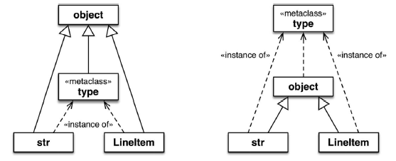
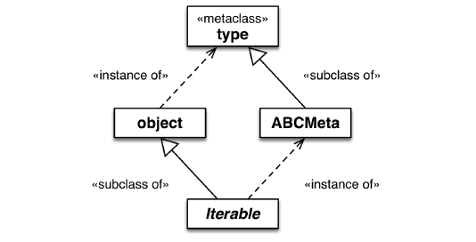

# 元类编程

元类是产生类的类,元类编程是一种使用这一特性,通过定制元类实现元编程的方法.也是python中最"正统"的元编程方式

本节需要的先验知识有:

+ [面向对象惯用法]()
+ [属性描述符]()

## type--类工厂

有时,我觉得应该有类似`nametuple`的工厂函数,用于创建可变对象.假设我在编写一个宠物店应用程序,我想把狗的数据当作简单的记录处理.编写下面的样板代码让人厌烦:


```python
class Dog:
    def __init__(self, name, weight, owner):
        self.name = name
        self.weight = weight
        self.owner = owner
```


```python
rex = Dog('Rex', 30, 'Bob')
rex
```


    <__main__.Dog at 0x4d11a58>


各个字段名称出现了三次.写了这么多样板代码,甚至字符串表示形式都不友好.

参考`namedtuple`,下面我们创建一个`record_factory`函数,即时创建简单的类


```python
def record_factory(cls_name, field_names):
    try:
        field_names = field_names.replace(',', ' ').split()
    except AttributeError: # 不能调用.replace或.split方法
        pass # 假定field_names本就是标识符组成的序列
    field_names = tuple(field_names) 
    
    def __init__(self, *args, **kwargs): 
        attrs = dict(zip(self.__slots__, args))
        attrs.update(kwargs)
        for name, value in attrs.items():
            setattr(self, name, value)
    
    def __iter__(self): 
        for name in self.__slots__:
            yield getattr(self, name)
    def __repr__(self): 
        values = ', '.join('{}={!r}'.format(*i) for i in zip(self.__slots__, self))
        return '{}({})'.format(self.__class__.__name__, values)
    
    cls_attrs = dict(__slots__ = field_names, __init__ = __init__,__iter__ = __iter__,__repr__ = __repr__)
    return type(cls_name, (object,), cls_attrs)
```


```python
Cat = record_factory('Cat', 'name weight owner') 
```


```python
rex = Cat('Rex', 30, 'Bob')
rex
```


    Cat(name='Rex', weight=30, owner='Bob')


```python
name, weight, _ = rex
name, weight
```


    ('Rex', 30)


```python
"{2}'s dog weighs {1}kg".format(*rex)
```


    "Bob's dog weighs 30kg"


```python
rex.weight = 32
rex
```


    Cat(name='Rex', weight=32, owner='Bob')


```python
Cat.__mro__
```


    (__main__.Cat, object)


可以看出上面的工厂函数核心就在于`type()`的使用.通常,我们把`type`视作函数,因为我们像函数那样使用它,例如,调用`type(my_object)`
获取对象所属的类——作用与`my_object.__class__`相同.

然而,`type`是一个类.当成类使用时,传入三个参数可以新建一个类:

```python
MyClass = type('MyClass', (MySuperClass, MyMixin),{'x': 42, 'x2': lambda self: self.x * 2})
```

type的三个参数分别是`name`、`bases` 和`dict`.最后一个参数是一个映射,指定新类的属性名和值.

## 元类

元类是制造类的工厂,不过不是函数而是类.

根据Python对象模型,类是对象,因此类肯定是另外某个类的实例.默认情况下,Python中的类是type类的实例.也就是说,type是大多数内置的类和用户定义的类的元类.


```python
'spam'.__class__
```


    str


```python
str.__class__
```


    type


```python
type.__class__
```


    type


为了避免无限回溯,type 是其自身的实例,如最后一行所示.


注意，我没有说str或其他对象继承自type.我的意思是,str和其他对象是type的实例.这两个类是object的子类.下图是他们的关系



两个示意图都是正确的.左边的示意图强调`str`、`type` 和`LineItem` 是`object` 的子类.右边的示意图则清楚地表明`str`、`object` 和`LineItem`是`type`的实例.因为它们都是类.

除了type,标准库中还有一些别的元类.例如`ABCMeta`和`Enum`.如下述代码片段所示,`collections.Iterable` 所属的类是`abc.ABCMeta`.`Iterable`是抽象类,而`ABCMeta`不是--不管怎样,`Iterable`是`ABCMeta`的实例.


```python
import collections
collections.Iterable.__class__
```


```python
import abc
abc.ABCMeta.__class__
```


```python
abc.ABCMeta.__mro__
```


    (abc.ABCMeta, type, object)


向上追溯,`ABCMeta`最终所属的类也是`type`.所有类都直接或间接地是`type`的实例,不过只有元类同时也是`type`的子类.若想理解元类,一定要知道这种关系:元类(如`ABCMeta`)从`type`类继承了构建类的能力.



我们要抓住的重点是,所有类都是type的实例,但是元类还是`type`的子类,因此可以作为制造类的工厂.具体来说,元类可以通过实现`__init__`方法定制实例.元类的`__init__`方法可以做到类装饰器能做的任何事情,但是作用更大.


```python
%%writefile evaltime_meta.py
from evalsupport import deco_alpha
from evalsupport import MetaAleph
print('<[1]> evaltime_meta module start')

@deco_alpha
class ClassThree():
    print('<[2]> ClassThree body')
    def method_y(self):
        print('<[3]> ClassThree.method_y')
        
class ClassFour(ClassThree):
    print('<[4]> ClassFour body')
    def method_y(self):
        print('<[5]> ClassFour.method_y')
class ClassFive(metaclass=MetaAleph):
    print('<[6]> ClassFive body')
    def __init__(self):
        print('<[7]> ClassFive.__init__')
    def method_z(self):
        print('<[8]> ClassFive.method_z')
class ClassSix(ClassFive):
    print('<[9]> ClassSix body')
    def method_z(self):
        print('<[10]> ClassSix.method_z')
        
if __name__ == '__main__':
    print('<[11]> ClassThree tests', 30 * '.')
    three = ClassThree()
    three.method_y()
    print('<[12]> ClassFour tests', 30 * '.')
    four = ClassFour()
    four.method_y()
    print('<[13]> ClassFive tests', 30 * '.')
    five = ClassFive()
    five.method_z()
    print('<[14]> ClassSix tests', 30 * '.')
    six = ClassSix()
    six.method_z()
print('<[15]> evaltime_meta module end')
```

    Overwriting evaltime_meta.py


```python
import evaltime_meta
```

    <[100]> evalsupport module start
    <[400]> MetaAleph body
    <[700]> evalsupport module end
    <[1]> evaltime_meta module start
    <[2]> ClassThree body
    <[200]> deco_alpha
    <[4]> ClassFour body
    <[6]> ClassFive body
    <[500]> MetaAleph.__init__
    <[9]> ClassSix body
    <[500]> MetaAleph.__init__
    <[15]> evaltime_meta module end


```python
!python evaltime_meta.py
```

    <[100]> evalsupport module start
    <[400]> MetaAleph body
    <[700]> evalsupport module end
    <[1]> evaltime_meta module start
    <[2]> ClassThree body
    <[200]> deco_alpha
    <[4]> ClassFour body
    <[6]> ClassFive body
    <[500]> MetaAleph.__init__
    <[9]> ClassSix body
    <[500]> MetaAleph.__init__
    <[11]> ClassThree tests ..............................
    <[300]> deco_alpha:inner_1
    <[12]> ClassFour tests ..............................
    <[5]> ClassFour.method_y
    <[13]> ClassFive tests ..............................
    <[7]> ClassFive.__init__
    <[600]> MetaAleph.__init__:inner_2
    <[14]> ClassSix tests ..............................
    <[7]> ClassFive.__init__
    <[600]> MetaAleph.__init__:inner_2
    <[15]> evaltime_meta module end


## 元类的定义和使用:
    
元类继承自`type`,行为通过实现

+ `__new__(meta,name,bases,class_dict)`
    
    类似于类中的`__new__`,用于定义元类的创建行为
    
+ `__init__(cls, name, bases,attr_dict)`

    类似于类中的`__init__`,用于初始化元类,通过元类产生类时会用到.
    
+ `__call__(cls)`

    定义类实例化时的行为.
    
+ 类方法`__prepare__(meta, name, bases)`
    
    解释器调用元类的`__new__` 方法之前会先调用`__prepare__` 方法,使用类定义体中的属性创建映射.`__prepare__` 方法的第一个参数是元类,随后两个参数分别是要构建的类的名称和基类组成的元组,返回值必须是映射.元类构建新类时,`__prepare__ `方法返回的映射会传给`__new__` 方法的最后一个参数,然后再传给`__init__` 方法.


使用元类的类实例化产出类的顺序是:

1. `meta.__prepare__`
2. `meta.__new__`
3. `meta.__init__`

类实例化对象的顺序是:

1. `clz.__call__`
2. `clz.__new__`
3. `clz.__init__`


```python
class meta_A(type):
    def __call__(clz,*args, **kwargs):
        print("clz.call")
        return super().__call__(*args, **kwargs)
    def __new__(meta,name,bases,class_dict):
        print("meta.new")
        return type.__new__(meta,name,bases,class_dict)
    def __init__(cls, name, bases,attr_dict):
        print("meta.init")
        super().__init__(name, bases,attr_dict)
    @classmethod
    def __prepare__(meta, name, bases):
        print('meta.prepare')
        return dict()
```


```python
class A(metaclass = meta_A):
    def __new__(cls,*args, **kwargs):
        print('clz.new')
        return super().__new__(cls)
    def __init__(self,name):
        self.name=name
        print('clz.init')
```

    meta.prepare
    meta.new
    meta.init


```python
a = A("qw")
```

    clz.call
    clz.new
    clz.init


```python
a.name
```


    'qw'


## 元类的基本用途

一般来说能不用元类就别用元类,或者说元编程的部分都是这个原则,能不用就别用,但很多时候为了实现一些特殊功能我们不得不用元类来实现

### 用来验证子类

元类的最简单用途就是用来验证其子类是否定义正确.构建复杂类体系时我们可能需要确保类风格一致,确保某些方法得到了覆写,或者确保类属性之间具有某些严格的关系.

元类提供了一种可靠的验证方式,每当开发者定义新类时,他会运行验证代码,确保符合规定.

实现这个功能并非必须使用元类,可以在`__init__`中写验证代码,在类初始化的时候验证,但如果想构建的时候就验证,那就需要使用元类了.

例: 确保类及其子类定义的图形边数大于3:


```python
class ValidatePolygon(type):
    def __new__(meta,name,bases,class_dict):
        if bases != (object):
            if class_dict['sides'] is not None and class_dict['sides'] < 3:
                raise ValueError('Polygons need 3+ sides')
        return type.__new__(meta,name,bases,class_dict)
```


```python
class Polygon(metaclass=ValidatePolygon):
    sides = None
    @classmethod
    def interior_angles(cls):
        return (cls.sides-2) * 180
    
class Triangle(Polygon):
    sides = 3
```


```python
class Line(Polygon):
    print("before sides")
    sides = 1
    print("after sides")
```

    before sides
    after sides


    ---------------------------------------------------------------------------

    ValueError                                Traceback (most recent call last)

    <ipython-input-28-e20553cfa6ed> in <module>()
    ----> 1 class Line(Polygon):
          2     print("before sides")
          3     sides = 1
          4     print("after sides")


    <ipython-input-26-e69e16a4cd97> in __new__(meta, name, bases, class_dict)
          3         if bases != (object):
          4             if class_dict['sides'] is not None and class_dict['sides'] < 3:
    ----> 5                 raise ValueError('Polygons need 3+ sides')
          6         return type.__new__(meta,name,bases,class_dict)


    ValueError: Polygons need 3+ sides


### 用来注册子类

元类的另一个用途是在程序中自动注册类型,对于需要反向查找(reverse lookup)的场合会有用.它使我们可以在简单的标识符与对应的类之间建立映射.

例: 我们希望使用下面的这个类将python对象表示为json格式的序列化数据.但同时我们希望可以反序列化,这就要用到元类了.


```python
import json
registry = {}
def register_class(target):
    registry[target.__name__] = target
    
def deserialize(data):
    params = json.loads(data)
    name = params["class"]
    target_class = registry[name]
    return target_class(*params["args"])
class Meta(type):
    def __new__(meta,name,bases,class_dict):
        cls = type.__new__(meta,name,bases,class_dict)
        register_class(cls)
        return cls
class Serializable:
    def __init__(self,*args):
        self.args = args
    def serialize(self):
        return json.dumps({
            'class':self.__class__.__name__,
            'args':self.args,
        })
class RegisterSerializable(Serializable,metaclass = Meta):
    pass
```


```python
class Vector3D(RegisterSerializable):
    def __init__(self,x,y,z):
        super().__init__(x,y,z)
        self.x,self.y,self.z = x,y,z
```


```python
v3 = Vector3D(10,-7,3)
```


```python
v3.serialize()
```


    '{"class": "Vector3D", "args": [10, -7, 3]}'


```python
v = deserialize(v3.serialize())
```


```python
v.args
```


    (10, -7, 3)


### 用来与描述符结合使用注解属性

用来解决`LineItem`倒数第二版问题的另一个方法就是使用元类


```python
import abc
class AutoStorage:
    __counter = 0
    def __init__(self):
        cls = self.__class__
        prefix = cls.__name__
        index = cls.__counter
        self.storage_name = '_{}#{}'.format(prefix, index)
        cls.__counter += 1
    def __get__(self, instance, owner):
        if instance is None:
            return self
        else:
            return getattr(instance, self.storage_name)
    def __set__(self, instance, value):
        setattr(instance, self.storage_name, value)
        
    def __set_name__(self, owner, name):
        self.name = name
class Validated(abc.ABC, AutoStorage): 
    def __set__(self, instance, value):
        value = self.validate(instance, value)
        super().__set__(instance, value)
    @abc.abstractmethod
    def validate(self, instance, value):
        """return validated value or raise ValueError"""
        pass
class Quantity(Validated): 
    """a number greater than zero"""
    def validate(self, instance, value):
        if value <= 0:
            raise ValueError('value must be > 0')
        return value
    
class NonBlank(Validated):
    def validate(self, instance, value):
        value = value.strip()
        if len(value) == 0:
            raise ValueError('value cannot be empty or blank')
        return value
```


```python
class EntityMeta(type):
    """元类，用于创建带有验证字段的业务实体"""
    def __init__(cls, name, bases, attr_dict):
        super().__init__(name, bases, attr_dict) 
        for key, attr in attr_dict.items():
            if isinstance(attr, Validated):
                type_name = type(attr).__name__
                attr.storage_name = '_{}#{}'.format(type_name, key)
                
class Entity(metaclass=EntityMeta):
    """带有验证字段的业务实体"""
    
```

用户级别的代码只需继承`Entity`类,`Validated` 字段就能自动获得储存属性的名称.


```python
class LineItem(Entity):
    description = NonBlank()
    weight = Quantity()
    price = Quantity()
    def __init__(self, description, weight, price):
        self.description = description
        self.weight = weight
        self.price = price
    def subtotal(self):
        return self.weight * self.price
```


```python
raisins = LineItem('Golden raisins', 10, 6.95)
dir(raisins)[:3]
```


    ['_NonBlank#description', '_Quantity#price', '_Quantity#weight']


```python
LineItem.description.storage_name
```


    '_NonBlank#description'


如前所述`type`构造方法及元类的`__new__ `和`__init__` 方法都会收到要计算的类的定义体,形式是名称到属性的映像.然而在默认情况下,那个映射是字典;也就是说元类或类装饰器获得映射时,属性在类定义体中的顺序已经丢失了.

这个问题的解决办法是,使用Python3引入的特殊方法`__prepare__`.解释器调用元类的`__new__` 方法之前会先调用`__prepare__`方法，使用类定义体中的属性创建映射.

`__prepare__`方法的第一个参数是元类,随后两个参数分别是要构建的类的名称和基类组成的元组,返回值必须是映射.

元类构建新类时,`__prepare__`方法返回的映射会传给`__new__ `方法的最后一个参数,然后再传给`__init__`方法.


```python
import collections
class EntityMeta(type):
    """元类，用于创建带有验证字段的业务实体"""
    @classmethod
    def __prepare__(cls, name, bases):
        return collections.OrderedDict()
    def __init__(cls, name, bases, attr_dict):
        super().__init__(name, bases, attr_dict) 
        cls._field_names = []
        for key, attr in attr_dict.items():
            if isinstance(attr, Validated):
                type_name = type(attr).__name__
                attr.storage_name = '_{}#{}'.format(type_name, key)
                cls._field_names.append(key)
                
class Entity(metaclass=EntityMeta):
    """带有验证字段的业务实体"""
    @classmethod
    def field_names(cls):
        for name in cls._field_names:
            yield name
```


```python
class LineItem(Entity):
    description = NonBlank()
    weight = Quantity()
    price = Quantity()
    def __init__(self, description, weight, price):
        self.description = description
        self.weight = weight
        self.price = price
    def subtotal(self):
        return self.weight * self.price
```


```python
for name in LineItem.field_names():
    print(name)
```

    description
    weight
    price

