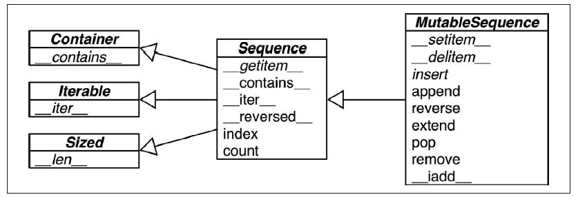

# 字节与字节序列

Python内置了两种基本的二进制序列类型：

+ Python 3 引入的不可变bytes 类型
+ Python 2.6 添加的可变bytearray 类型

`bytes` 或`bytearray` 对象的各个元素是介于`0~255`(含)之间的整数.然而，二进制序列的切片始终是同一类型的二进制序列，包括长度为1 的切片


```python
cafe = bytes('café', encoding='utf_8')
```


```python
cafe
```


    b'caf\xc3\xa9'


```python
cafe[0] # 单个元素为0~255之间的整数
```


    99


```python
cafe[:1] # 使用切片则返回同类型序列
```


    b'c'


### bytearray是可变序列

不同于bytes,bytearray是可变序列.它是可以修改的,行为类似list.


```python
cafe_arr = bytearray(cafe)
```


```python
cafe_arr.append(2)
```


```python
cafe_arr
```


    bytearray(b'caf\xc3\xa9\x02')


虽然二进制序列其实是整数序列，但是它们的字面量表示法表明其中有`ASCII`文本。因
此，各个字节的值可能会使用下列三种不同的方式显示。

+ 可打印的ASCII 范围内的字节（从空格到`~`），使用ASCII 字符本身。
+ 制表符、换行符、回车符和`\ `对应的字节，使用转义序列`\t`、`\n`、`\r` 和`\\`。
+ 其他字节的值，使用十六进制转义序列（例如，`\x00` 是空字节）。

### 格式化二进制序列

除了格式化方法(`format` 和`format_map`) 和几个处理`Unicode`数据的方法(包括`casefold`、`isdecimal`、`isidentifier`、`isnumeric`、`isprintable` 和`encode`) 之外，str 类型的其他方法都支持`bytes`和`bytearray` 类型。这意味着，我们可以使用熟悉的字符串方法处理二进制序列，如endswith、replace、strip、translate、upper 等，只有少数几个其他方法的参数是bytes 对象，而不是str 对象。

此外，如果正则表达式编译自二进制序列而不是字符串，re 模块中的正则表达式函数也能处理二进制序列.

Python不能使用`foramte`方法处理二进制序列,只能使用`%`运算符处理二进制序列.


```python
print(b"sadfg%d" % (12))
```

    b'sadfg12'
    


```python
print(b"sadfg{}".format(12))
```


    ---------------------------------------------------------------------------

    AttributeError                            Traceback (most recent call last)

    <ipython-input-9-be82b952b3d9> in <module>()
    ----> 1 print(b"sadfg{}".format(12))
    

    AttributeError: 'bytes' object has no attribute 'format'


### 二进制序列创建

二进制序列有个类方法是`str`没有的,名为`fromhex`,它的作用是解析十六进制数字对(数字对之间的空格是可选的),构建二进制序列:


```python
bytes.fromhex('31 4B CE A9')
```


    b'1K\xce\xa9'


通过str编码而来


```python
"流星雨".encode("utf-8")
```


    b'\xe6\xb5\x81\xe6\x98\x9f\xe9\x9b\xa8'


构建`bytes` 或 `bytearray` 实例还可以调用各自的构造方法,传入下述参数。

+ 一个 `str` 对象和一个 `encoding` 关键字参数。


```python
bytes('sphinx',encoding="utf-8")
```


    b'sphinx'


+ 一个可迭代对象,提供 0~255 之间的数值。


```python
bytes([12,34,32,212])
```


    b'\x0c" \xd4'


+ 一个实现了缓冲协议的对象(如 bytes、bytearray、memoryview、array.array);此时,把源对象中的字节序列复制到新建的二进制序列中


```python
import array
numbers = array.array('h', [-2, -1, 0, 1, 2])
octets = bytes(numbers)
octets
```


    b'\xfe\xff\xff\xff\x00\x00\x01\x00\x02\x00'


# python与内存

Cpython本质上是建筑在C语言上的,python也有工具直接如同C语言一样处理内存.

## 内存与位

所谓内存是一段连续的物理内存片段,一般内存都是按bytes分段使用的,一位(bit)就是一个二进制位(存储二进制数据),而一个byte就是8位二进制位.因此每一位看作一个10进制数的话,其范围为$0\to(2^8-1)$ 也就是0~255这就与我们python的bytes对象对应起来了.

无论是什么对象什么类型,数据存在内存中的永远是0,1构成的编码,因此总可以使用bytes来处理.而类型本质上来说只是指示编码的工具.

### 位运算

python的数字但一般来说默认的表现形式是10进制的,也有2进制,8进制16进制的表现形式,但实际上是转化为str.


```python
num1 = 1
```


```python
num2 = 0
```


```python
bnum1 = bin(num1)
bnum1
```


    '0b1'


```python
hnum1 = hex(num1)
hnum1
```


    '0x1'


```python
onum1 = oct(num1)
onum1
```


    '0o1'


```python
bnum2 = bin(num2)
bnum2
```


    '0b0'


```python
hnum2 = hex(num2)
hnum2
```


    '0x0'


```python
onum2 = oct(num2)
onum2
```


    '0o0'


python也有位运算.但只有int类型才可以使用


```python
bin(num1&num2)#按位与 &
```


    '0b0'


```python
bin(num1&num1)#按位与 &
```


    '0b1'


```python
bin(num2&num2)#按位与 &
```


    '0b0'


```python
bin(num1|num2)#按位或
```


    '0b1'


```python
bin(num1|num1)#按位或
```


    '0b1'


```python
bin(num2|num2)#按位或
```


    '0b0'


```python
bin(num1^num2)#按位异或 ^
```


    '0b1'


```python
bin(num1^num1)#按位异或 ^
```


    '0b0'


```python
bin(num2^num2)#按位异或 ^
```


    '0b0'


```python
bin(~num2)#按位翻转~
```


    '-0b1'


```python
~num2
```


    -1


```python
bin(~num1)#按位翻转~
```


    '-0b10'


```python
~num1
```


    -2


```python
bin(num1<<1)#左移运算符  << 
```


    '0b10'


```python
bin(num1>>1)#左移运算符  >>
```


    '0b0'


## array对象

python有一个很特殊的序列类型`array.array`,它是同构可变序列,需要指定类型,事实上str,bytes,btyearray,memoryview都是同构序列,他们实际上是一段连续的内存,因此更加紧凑也更加高效.



array.array,它是同构可变序列,需要指定类型.这些类型必须是与C语言中对应的.可以指定的类型有:

Type code |C Type | Minimum size in bytes
---|---|---
'c'| character|1
'b'| signed integer|1
'B'|unsigned integer|1
'u'|Unicode character|2
'h'|signed integer|2
'H'|unsigned integer|2
'i'|signed integer |2
'I'|unsigned integer|2
'l'|signed integer|4
'L'|unsigned integer|4
'f'|floating point |4
'd'|floating point |8　　


```python
from array import array
from random import random
```


```python
floats = array('d', (random() for i in range(10**7)))
```


```python
floats[-1]
```


    0.13967783903892583


```python
with open('output/floats.bin', 'wb') as fp:
    floats.tofile(fp)
```


```python
floats2 = array('d')
```


```python
with open('output/floats.bin', 'rb') as fp:
    floats2.fromfile(fp,10**7)#把1000 万个浮点数从二进制文件里读取出来
```


```python
floats2[-1]
```


    0.13967783903892583


```python
floats2 == floats
```


    True


`array.tofile`和`array.fromfile`用起来很简单。把这段代码跑一跑，你还会发现它的速度也很快。一个小试验告诉我，用array.fromfile 从一个二
进制文件里读出1000万个双精度浮点数只需要0.1 秒，这比从文本文件里读取的速度要快60 倍，因为后者会使用内置的float 方法把每一行文字转换成浮点数。另外，使用`array.tofile` 写入到二进制文件，比以每行一个浮点数的方式把所有数字写入到文本文件要快7倍。另外，1000 万个这样的数在二进制文件里只占用80 000 000 个字节（每个浮点数占用8 个字节，不需要任何额外空间），如果是文本文件的话，我们需要181 515 739 个字节。

## 内存缓冲对象与二进制序列


使用缓冲类对象创建 `bytes` 或 `bytearray` 对象时,始终复制源对象中的字节序列。与之相反, `memoryview` 对象允许在二进制数据结构之间共享内存。如果想从二进制序列中提取结构化信息,`struct`模块是重要的工具。


### memoryview

`memoryview` 是一个内置类,它能让用户在不复制内容的情况下操作同一个数组的不同切片.`memoryview`的概念受到了`NumPy`的启发其实是泛化和去数学化的`NumPy`数组.它让你在不需要复制内容的前提下, 在数据结构之间共享内存。其中数据结构可以是任何形式,比如`PIL`图片、`SQLite`数据库和 `NumPy`的数组,等等。这个功能在处理大型数据集合的时候非常重要。

`memoryview.cast` 的概念跟数组模块类似,能用不同的方式读写同一块内存数据,而且内容 字节不会随意移动。这听上去又跟`C` 语言中类型转换的概念差不多.`memoryview.cast` 会把同一块内存里的内容打包成一个全新的 `memoryview` 对象给你。

我们利用 `memoryview` 精准地修改了一个数组的某个字节,这个数组的元素是 16 位二进制整数


```python
numbers = array.array('h', [-2, -1, 0, 1, 2]) #有符号整数(2个字节)
memv = memoryview(numbers)
len(memv)
```


    5


```python
memv[0]
```


    -2


```python
memv_oct = memv.cast('B') # 转化为无符号(单字节)
memv_oct.tolist() 
```


    [254, 255, 255, 255, 0, 0, 1, 0, 2, 0]


```python
memv_oct[5] = 4 
memv_oct.tolist() 
```


    [254, 255, 255, 255, 0, 4, 1, 0, 2, 0]


```python
numbers
```


    array('h', [-2, -1, 1024, 1, 2])


### struct

struct就是结构体,C中的结构体就是一段连续的内存空间,顺序地存储指定类型的内容.

struct解包需要知道字节顺序,打包的后的字节顺序默认上是由操作系统的决定的，当然struct模块也提供了自定义字节顺序的功能，可以指定大端存储、小端存储等特定的字节顺序，对于底层通信的字节顺序是十分重要的，不同的字节顺序和存储方式也会导致字节大小的不同。在format字符串前面加上特定的符号即可以表示不同的字节顺序存储方式，例如采用小端存储 `s = struct.Struct(‘<I3sf’)`就可以了。


字节顺序字符串定义规则如下:

Character|	Byte order|	Size|	Alignment
---|---|---|---
`@`|native	|native|	native
`=`	|native|	standard	|none
`<`|little-endian|	standard|	none
`>`|big-endian	|standard|	none
`!`	|network (= big-endian)	|standard	|none

python中也是类似功能.与array类似,也需要为每段指定数据类型:


Format	|C Type|	Python type|	Standard size|	Notes
---|---|---|---|---
x|	pad byte|no value|---|--- 	 
c|	char|	bytes of length 1|1	 |---
b|signed char|	integer|	1	|---
B|unsigned char	|integer|	1	|---
`?`|`_Bool`|	bool|	1|	---
h|short|	integer|	2|---
H|unsigned short|	integer|	2|---
i|int	|integer|	4	|---
I|unsigned int	|integer|	4	|---
l|long	|integer|	4	|---
L|unsigned long	|integer|	4	|---
q|long long	|integer|	8	|---
Q|unsigned long long	|integer|	8	|---
n|ssize_t|integer	|---|---
N|size_t	|integer|---|---
e|---|	float|	2	|半精度浮点数
f|float	|float|	4	|---
d|double|	float	|8	|---
s|char[]	|bytes	 |	 ---|---
p|char[]	|bytes	 |	---|--- 
P|void `*`|	integer|---	 |---


#### 利用buffer，使用pack_into和unpack_from方法

使用二进制打包数据的场景大部分都是对性能要求比较高的使用环境。而在上面提到的pack方法都是对输入数据进行操作后重新创建了一个内存空间用于返回，也就是说我们每次pack都会在内存中分配出相应的内存资源，这有时是一种很大的性能浪费。struct模块还提供了pack_into() 和 unpack_from()的方法用来解决这样的问题，也就是对一个已经提前分配好的buffer进行字节的填充，而不会每次都产生一个新对象对字节进行存储。


```python
import struct
import binascii
import ctypes
```


```python
values = (1, b'abc', 2.7)
s = struct.Struct('I3sf')# 指定类型
prebuffer = ctypes.create_string_buffer(s.size)#ctypes模块创建一个缓冲
```


```python
print('Before :',binascii.hexlify(prebuffer))
```

    Before : b'000000000000000000000000'
    


```python
s.pack_into(prebuffer,0,*values)
print('After pack:',binascii.hexlify(prebuffer))
```

    After pack: b'0100000061626300cdcc2c40'
    


```python
unpacked = s.unpack_from(prebuffer,0)
print('After unpack:',unpacked)
```

    After unpack: (1, b'abc', 2.700000047683716)
    

我们可以把多个对象pack到一个buffer里面，然后通过指定不同的offset进行unpack


```python
import struct
import binascii
import ctypes
 
values1 = (1, b'abc', 2.7)
values2 = (b'defg',101)
s1 = struct.Struct('I3sf')
s2 = struct.Struct('4sI')
 
prebuffer = ctypes.create_string_buffer(s1.size+s2.size)
print('Before :',binascii.hexlify(prebuffer))
s1.pack_into(prebuffer,0,*values1)
s2.pack_into(prebuffer,s1.size,*values2)
print('After pack:',binascii.hexlify(prebuffer))
print(s1.unpack_from(prebuffer,0))
print(s2.unpack_from(prebuffer,s1.size))
```

    Before : b'0000000000000000000000000000000000000000'
    After pack: b'0100000061626300cdcc2c406465666765000000'
    (1, b'abc', 2.700000047683716)
    (b'defg', 101)
    

### memoryview 和 struct 

`struct` 模块提供了一些函数,把打包的字节序列转换成不同类型字段组成的元组,还有一些函数用于执行反向转换,把元组转换成打包的字节序列。`struct` 模块能处理`bytes`、`bytearray`和`memoryview`对象。

`memoryview` 类不是用于创建或存储字节序列的,而是共享内存,让你访问其他二进制序列、打包的数组和缓冲中的数据切片,而无需复制字节序列,例如`PIL` 就是这样处理图像的.

下例使用`memoryview` 和`struct` 提取一个 GIF 图像的宽度和高度


```python
import struct
# 结构体的格式:< 是小字节序,3s3s 是两个 3 字节序列,
#HH 是两个 16 位二进制整数
fmt = '<3s3sHH' 
with open('source/mysite.gif', 'rb') as fp:
    img = memoryview(fp.read())
    
header = img[:10]
bytes(header)# 转换成字节序列,这只是为了显示;这里复制了 10 字节

```


    b'GIF89a,\x01,\x01'


```python
# 拆包 memoryview 对象,得到一个元组,包含类型、版本、宽度和高度
struct.unpack(fmt, header)
```


    (b'GIF', b'89a', 300, 300)


```python
#删除引用,释放 memoryview 实例所占的内存
del header
del img
```

### mmap做文件映射

python提供一个mmap模块用于将文件映射至内存,即将一个文件或者其它对象映射到进程的地址空间,实现文件磁盘地址和进程虚拟地址空间中一段虚拟地址的一一对映关系.mmap对象可以作为进程间通过文件进行 IPC 的一种替换手段.

#### 创建 mmap 对象

+ windows 

mmap(filedesc, length, tagname='')

+ Unix

mmap(filedesc, length, flag=MAP_SHARED, prot=PROT_READ|PROT_WRITE)


创建并返回一个 mmap 对象，参数 `filedesc` 通常是由 `f.fileno()`获得的.

mmap 创建对象的含义是：将指定 fd 的前 length 字节映射到内存。


Windows中，可以通过参数tagname为一段内存映射指定名称，这样一个文件上面可以同时具有多个 mmap。windows中的内存映射都是可读可写的，同时在进程之间共享。


Unix平台上，参数 flags 的可选值包括：

+ mmap.MAP_PRIVATE：这段内存映射只有本进程可用；

+ mmap.MAP_SHARED：将内存映射和其他进程共享，所有映射了同一文件的进程，都能够看到其中一个所做的更改；

参数 prot 对应的取值包括：`mmap.PROT_READ`, `mmap.PROT_WRITE` 和 `mmap.PROT_WRITE | mmap.PROT_READ`。最后一者的含义是同时可读可写。

mmap 对象的方法:

+ `m.close()` 　　关闭 m 对应的文件；

+ `m.find(str, start=0)` 　　从 start 下标开始，在 m 中从左往右寻找子串 str 最早出现的下标；

+ `m.flush([offset, n])` 　　把 m 中从offset开始的n个字节刷到对应的文件中，参数 offset 要么同时指定，要么同时不指定；

+ `m.move(dstoff, srcoff, n)` 　　等于 m[dstoff:dstoff+n] = m[srcoff:srcoff+n]，把从 srcoff 开始的 n 个字节复制到从 dstoff 开始的n个字节，可能会覆盖重叠的部分。

+ `m.read(n)` 　　返回一个字符串，从 m 对应的文件中最多读取 n 个字节，将会把 m 对应文件的位置指针向后移动；

+ `m.read_byte()` 　　返回一个1字节长的字符串，从 m 对应的文件中读1个字节，要是已经到了EOF还调用 read_byte()，则抛出异常 ValueError；

+ `m.readline()` 　　返回一个字符串，从 m 对应文件的当前位置到下一个'\n'，当调用 readline() 时文件位于 EOF，则返回空字符串；

+ `m.resize(n)` 　　把 m 的长度改为 n，m 的长度和 m 对应文件的长度是独立的；

+ `m.seek(pos, how=0)` 　　同 file 对象的 seek 操作，改变 m 对应的文件的当前位置；

+ `m.size()`　 　返回 m 对应文件的长度（不是 m 对象的长度len(m)）；

+ `m.tell()` 　　返回 m 对应文件的当前位置；

+ `m.write(bytes)` 　　把二进制字节序列写到 m 对应文件的当前位置，如果从 m 对应文件的当前位置到 m 结尾剩余的空间不足`len(str)`，则抛出` ValueError`；

+ `m.write_byte(byte)` 　　把1个字节（对应一个字符）写到 m 对应文件的当前位置，实际上` m.write_byte(ch)` 等于 `m.write(ch)`。如果 m 对应文件的当前位置在 m 的结尾，也就是 m 对应文件的当前位置到 m 结尾剩余的空间不足1个字节，`write() `抛出异常ValueError，而` write_byte()` 什么都不做。

对于EOF的处理，`write()` 和 `read_byte()` 抛出异常` ValueError`，而 `write_byte() `和 `read()` 什么都不做。

使用mmap模块了，其大致特点如下：

+ 普通文件被映射到虚拟地址空间后，程序可以向访问普通内存一样对文件进行访问，在有些情况下可以提高IO效率。
+ 它占用物理内存空间少，可以解决内存空间不足的问题，适合处理超大文件。
+ 不同于通常的字符串对象，它是可变的，可以通过切片的方式更改，也可以定位当前文件位置m.tell()或m.seek()定位到文件的指定位置，再进行m.write(str)固定长度的修改操作。

mmap常用于处理大数据
